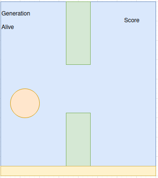
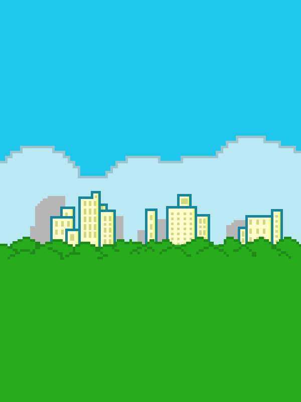
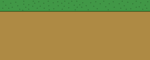
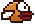
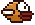
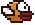

# ai-flappy-bird

At this point, the code base is still a mess and I'm exploring. Don't try this at home, kids :-)

## Images

The images have been created by myself. The GIMP sources can be found [here](image_sources/), the final assets can be found [here](images/).

### Scene Idea

The original idea for the Flappy Birds scene looks like this:

### Artwork

I've oriented on other Flappy Bird clones, however I'm not into stealing but I'm definitely into trying new things out, so I did my own "art" here. :-)

|          Background          |           Bottom Line           |
|:----------------------------:|:-------------------------------:|
|  |  |

|       Bird Movements       |                            |                            |
|:--------------------------:|:--------------------------:|:--------------------------:|
|  |  |  |
